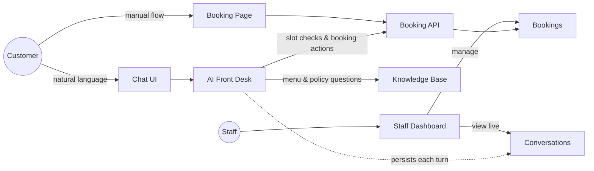
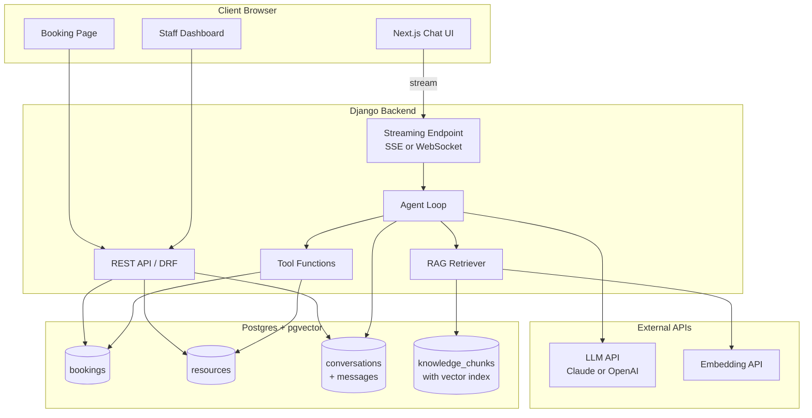
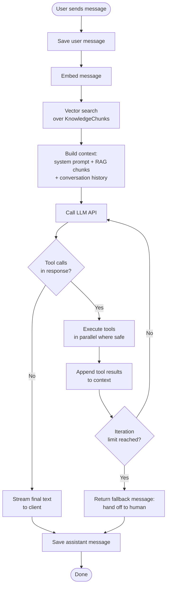
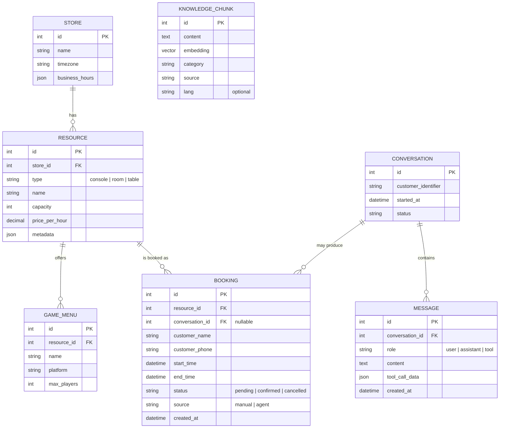

# PlayDesk — Development Plan

> **PlayDesk** is an AI-powered booking and front-desk platform for game lounges (PS5 / Switch / board games / private rooms). Built as a demo for the COSReady interview — mirroring their stack and product surface in an adjacent service-booking vertical.

**Stack mirror:** Django + Next.js + Postgres + pgvector + hand-rolled agent loop + RAG
**Goal:** Ship a working vertical slice that shows full-stack execution, real LLM integration, and production-aware AI design choices.

---

## 1. Must-Have Scope

### 1.1 Backend (Django + Postgres + pgvector)

**Stack**

- Django 4.x with Django REST Framework
- Postgres with the `pgvector` extension enabled

**Data layer**

- Models per the ER diagram in §3.4: `Store`, `Resource`, `GameMenu`, `Booking`, `Conversation`, `Message`, `KnowledgeChunk`
- Database-level overlap prevention on `Booking` using `EXCLUDE USING gist` over `(resource_id, tstzrange(start_time, end_time))`. Do **not** rely on application-level conflict checks — concurrent inserts must be rejected by Postgres itself.

**REST endpoints**

- `GET /api/resources/` — list resources, filterable by `type`
- `GET /api/resources/<id>/availability/?date=YYYY-MM-DD` — compute open slots from business hours minus existing bookings
- `POST /api/bookings/` — create booking, returns `409` on overlap
- `GET /api/bookings/`, `PATCH /api/bookings/<id>/`, `DELETE /api/bookings/<id>/`
- `POST /api/conversations/<id>/messages/` — send user message, returns streaming assistant response
- `GET /api/admin/conversations/`, `GET /api/admin/bookings/` — staff visibility

**Streaming**

- Server-Sent Events (SSE) or WebSocket for token-by-token assistant output. Pick whichever ships faster; SSE is usually simpler with Django.

**Acceptance criteria**

- A `curl` round-trip can create, query, and cancel a booking
- Two concurrent inserts at the same `(resource_id, time)` reliably produce one success and one `409`
- The streaming endpoint emits assistant tokens incrementally, not in a single payload

---

### 1.2 Frontend (Next.js + Tailwind)

**Pages**

- `/` — Manual booking page: resource → date → time → confirm. This is the control-group flow against the AI flow.
- `/chat` — AI front desk chat UI with streaming tokens. Show small "checking availability…" / "looking up policy…" hints while a tool call is in flight.
- `/admin` — Staff dashboard with two views: live conversations, and all bookings sorted by `created_at` desc.

**Constraints**

- Tailwind defaults only — no mobile breakpoints, no custom design system, no shadcn unless it costs zero time.
- Dummy login or NextAuth one-click. No password flows, no email verification.

**Acceptance criteria**

- A user can complete a full booking through `/chat` and see it appear in `/admin` without refresh
- The chat UI does not freeze during long tool-call sequences

---

### 1.3 AI Core — Hand-Rolled Agent Loop

**Why hand-rolled:** total control over prompt construction, retry, token accounting, and observability. Avoids the abstraction debt of LangChain — and lets you explain every line in the interview.

**Loop structure**

1. Assemble context: system prompt + top-k RAG chunks + last N conversation messages
2. Call the LLM
3. If the response contains tool calls: run them (in parallel where safe), append structured results to context, go to step 2
4. If the response is plain text: stream to client, persist, end
5. Hard cap at 6 iterations with a graceful fallback ("Let me hand this over to a human teammate")

**Persistence**

- Every turn (user message, assistant text, tool call, tool result) is one row in `Message`
- Tool call payload + result stored as JSONB for later inspection / eval / debugging

**Error handling**

- LLM API failure → exponential backoff, max 3 retries
- Tool execution failure → return a structured error object back to the LLM (don't raise to the user). The LLM gets to recover or apologize.

**LLM choice**

- Recommend Claude for cleaner tool-use semantics. OpenAI is fine if you already have credits.

**Acceptance criteria**

- The agent completes a booking from a single natural-language message like *"Saturday 8pm, PS5 for 3 people, around 2 hours"*
- The `Message` table after a conversation reveals the full reasoning trace, readable end-to-end

---

### 1.4 RAG Layer

**Knowledge base content** (authored as Markdown / JSON, ingested by a management command):

- Game catalog (consoles + available titles + controller counts)
- Room and table specs (capacity, equipment, hourly rate)
- Business hours
- Policies: cancellation, deposit, refund, outside food, age limits
- FAQ

**Pipeline**

- Embedding model: OpenAI `text-embedding-3-small` (cheap, sufficient)
- Storage: `vector` column on `KnowledgeChunk`, with an HNSW index (fall back to IVFFlat if HNSW is unavailable in your pgvector version)
- Retrieval: embed the user's latest message, vector-search top-5, inject chunks into the system prompt along with their `category` and `source` metadata
- Re-ingest on knowledge base file changes (a Django management command is enough)

**Critical design rule**

- **RAG handles unstructured Q&A. SQL handles structured queries.**
  - Policies, menu descriptions, FAQ → RAG
  - Availability, pricing computation, booking state → SQL via tools
- The system prompt must instruct the LLM accordingly. Mixing these is the most common production failure pattern in early AI products, and worth calling out explicitly.

**Acceptance criteria**

- *"Can I bring outside food?"* → answered from the knowledge base
- *"Is room 3 free at 8pm tomorrow?"* → answered via `check_availability`, never via RAG

---

### 1.5 Agent Tools

Each tool is a Python function with a Pydantic schema exposed to the LLM.

| Tool | Purpose |
|------|---------|
| `search_knowledge_base(query)` | Vector search over `KnowledgeChunk` |
| `check_availability(resource_type, date, time_range, party_size)` | Return list of available slots |
| `get_resource_details(resource_type)` | Specs, pricing, included equipment |
| `create_booking(resource_id, start_time, duration_minutes, customer_name, customer_phone)` | Returns `booking_id` or a structured conflict error |
| `modify_booking(booking_id, new_start_time, new_duration)` | Adjust existing booking |
| `cancel_booking(booking_id)` | Cancel existing booking |

**Acceptance criteria**

- The system prompt explicitly partitions tool usage by query type
- Smoke-test conversations show the LLM picking the correct tool for each kind of question

---

## 2. Nice-to-Have Scope

### 2.1 Evaluation Set

- 10–15 curated test conversations, each labeled with expected behavior: `should_book`, `should_clarify`, `should_refuse`, `should_search_kb`
- A Python script that replays each conversation against the agent and asserts:
  - Was the correct tool called?
  - Was a booking created (or correctly not)?
  - Is the final assistant message on-topic?
- Output: per-case pass/fail and aggregate accuracy

**Why it matters:** the cleanest signal that you treat AI as a production system, not a demo toy. Mentioning evals in the interview is high-leverage.

---

### 2.2 Stripe Sandbox Integration

- On `create_booking`, optionally collect a deposit via Stripe Checkout in test mode
- Webhook handler updates `Booking.status` from `pending_payment` to `confirmed` on payment success
- Bookings in `pending_payment` state expire after a TTL (a periodic Django command is fine)

**Why it matters:** COSReady's job description explicitly lists Stripe — direct stack alignment.

---

### 2.3 Conflict-Aware Slot Suggestion

- When `check_availability` returns no slot for the requested time, the tool itself proposes 1–2 nearby alternatives (same day ±1 hour; same time on the next available day)
- The suggestion logic lives in the tool's response shape:
  ```json
  { "available": [], "suggestions": [{ "start": "...", "end": "..." }, ...] }
  ```
- The LLM doesn't have to invent alternatives — it just relays them naturally

**Why it matters:** converts a refusal into a possible booking. Product-thinking signal beyond pure engineering.

---

### 2.4 Bilingual Demo (English + Chinese)

- Knowledge base authored in both languages, with a `lang` field on `KnowledgeChunk`
- At retrieval time, filter by the detected language of the user message
- System prompt instructs the LLM to respond in the user's language

**Why it matters:** COSReady supports EN / 中 / 越 / 韩. Showing bilingual handling on day one signals you've thought about their international users.

---

## 3. Diagrams

### 3.1 User Diagram



---

### 3.2 Architecture Diagram



---

### 3.3 Flow Diagram (Agent Loop)



---

### 3.4 Data Diagram (ER)


