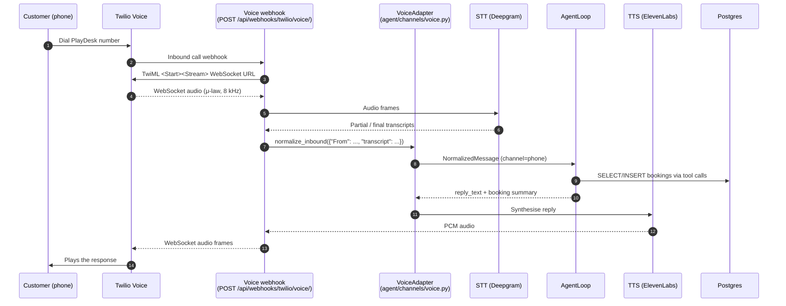

# Voice AI readiness

> Design-only. No STT or TTS code lands in v3. The point of this doc is
> to describe how a phone call would land in the existing agent loop,
> so the rest of the codebase doesn't make assumptions that would
> later need to be undone.

## Architecture

The agent loop, the booking tools, the RAG retriever, and the
`Customer` resolution all stay unchanged. Voice only adds STT in
front of the loop and TTS behind it; the channel adapter is the
single integration seam.

## Provider choices

Treat this as one possible stack, not a commitment. Anything else
that fits the contract — *streaming-friendly STT, low-latency TTS,
WebSocket-capable PSTN bridge* — works.

| Layer | Provider | Why |
|---|---|---|
| PSTN + WebSocket bridge | Twilio Voice + `<Stream>` | The Twilio adapter already exists for SMS; reusing the auth + signature plumbing saves an integration. Twilio's media streaming sends raw audio over WebSockets at ~20 ms frames. |
| Speech-to-text | Deepgram Streaming (Nova-3) | Sub-200 ms first-partial latency, native streaming, returns interim + final transcripts, handles barge-in cleanly. Alternatives: AssemblyAI Realtime, Google Cloud Speech v2. |
| Text-to-speech | ElevenLabs Turbo v2 | ~250 ms first-byte latency, voice cloning, both EN + 中文. Alternatives: Azure Neural TTS, Cartesia Sonic. |
| Endpointing | Server-side VAD (e.g. Silero) | Decides when the customer is done speaking so we don't fire the agent on every interim transcript. |

## Latency budget

The interaction feels live up to about **1.5 s** end-to-end. Past
that, customers start interrupting themselves. The budget per leg:

| Step | Target p95 | Notes |
|---|---|---|
| Twilio audio → STT first partial | 200 ms | Streaming STT means we don't wait for the whole utterance. |
| STT endpointing (silence → final) | 300 ms | Tuneable; tighter = more interruptions, looser = laggier. |
| Agent loop turn (no tool call) | 800 ms | Claude Haiku 4.5 is the default — Opus is too slow for voice. |
| Agent loop turn (one tool call) | 1300 ms | `check_availability` on a normal-sized DB is <50 ms; the LLM dominates. |
| TTS first audio byte | 300 ms | Streaming TTS — we don't wait for the whole reply. |
| **Conversational round-trip** | **~1.6 s** | Best case (no tool). With a tool call, ~2.1 s. |

The agent loop's six-iteration cap stays in place. A turn that would
exceed three iterations transitions to the same human-handoff flow
the SMS adapter uses today.

## Fallback behaviour

Voice is the most failure-prone channel — network blips, ASR errors,
the customer interrupting mid-sentence. The fallback ladder:

1. **Transient STT failure** — retry the WebSocket reconnect once;
   on the second failure, play a recorded "I'm having trouble hearing
   you, please hold" and re-prompt.
2. **LLM unavailable** — same `llm_unavailable` error code the SSE
   protocol already emits; the TwiML response transfers to a human
   queue ("Please hold while I connect you to staff").
3. **Tool call returns `unsafe_action`** — same handoff path; the
   conversation status flips to `escalated` and Twilio's `<Dial>`
   verb forwards the call.
4. **No human available out-of-hours** — record a voicemail and tag
   it `channel=phone` so the morning shift sees it in `/admin?channel=phone`.

In every case the conversation transcript is persisted in `Message`
rows, identical to the web-chat path, so staff can read it back.

## What to build first

If we ship voice in a v4 slice, this is the build order:

1. **`POST /api/webhooks/twilio/voice/` returning static TwiML.**
   Just a `<Say>` "thanks for calling" — proves the Twilio number
   routes to our endpoint and the signature validation works.
2. **WebSocket audio sink.** Accept Twilio's `<Stream>` frames into
   a Django Channels (or FastAPI sidecar) handler. Discard them —
   the goal is bidirectional connectivity.
3. **STT integration.** Pipe audio to Deepgram, write the final
   transcript to a log file. No agent loop yet.
4. **VoiceAdapter.normalize_inbound.** When STT emits a final
   transcript, build a `NormalizedMessage` and call the agent loop
   synchronously. Voice-mail style — play the reply via `<Say>` once
   the loop returns.
5. **Streaming TTS.** Replace `<Say>` with streaming TTS audio
   piped back through the same WebSocket. This is where the latency
   work happens.
6. **Barge-in.** Detect when the customer starts speaking while TTS
   is playing, stop the TTS stream, and start a new STT segment.

Steps 1–4 are mostly plumbing and could land in one sprint. Step 5
is the long pole — that's where most voice products live or die.

## Cross-references

- Channel adapter base: [`backend/agent/channels/base.py`](../backend/agent/channels/base.py)
- First concrete adapter (SMS): [`backend/agent/channels/twilio_sms.py`](../backend/agent/channels/twilio_sms.py)
- Webhook pattern: [`backend/api/webhooks_twilio.py`](../backend/api/webhooks_twilio.py)
- SSE protocol (for shared event shapes): [`docs/contracts/sse-protocol.md`](contracts/sse-protocol.md)
